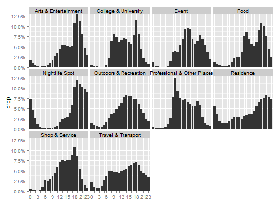

First, we load the libraries, functions, and data into the workspace.Following is a summary of the dataset.


```
##       gid             user_id            gender      
##  Min.   :      1   Min.   :      32   female:235071  
##  1st Qu.: 254982   1st Qu.: 1514021   male  :285587  
##  Median : 506430   Median : 6820154   NA's  :  7707  
##  Mean   : 505864   Mean   :15433981                  
##  3rd Qu.: 756951   3rd Qu.:21518413                  
##  Max.   :1135513   Max.   :88116325                  
##                                                      
##                      venue_id          lat.x          lon.x      
##  43a52546f964a520532c1fe3: 11454   Min.   :40.5   Min.   :-74.2  
##  4ace6c89f964a52078d020e3:  7211   1st Qu.:40.7   1st Qu.:-74.0  
##  42911d00f964a520f5231fe3:  3224   Median :40.7   Median :-74.0  
##  4ae6363ef964a520aba521e3:  2886   Mean   :40.7   Mean   :-74.0  
##  49b7ed6df964a52030531fe3:  2518   3rd Qu.:40.8   3rd Qu.:-74.0  
##  42829c80f964a5206a221fe3:  1999   Max.   :40.9   Max.   :-73.7  
##  (Other)                 :499073                                 
##   timestamps.x                             cate_l1      
##  Min.   :1.39e+09   Food                       :155557  
##  1st Qu.:1.39e+09   Shop & Service             : 83006  
##  Median :1.40e+09   Nightlife Spot             : 63810  
##  Mean   :1.40e+09   Travel & Transport         : 56886  
##  3rd Qu.:1.40e+09   Arts & Entertainment       : 55195  
##  Max.   :1.40e+09   Professional & Other Places: 52477  
##                     (Other)                    : 61434  
##                  cate_l2          datetime                  
##  Gym / Fitness Center: 29733   Min.   :2014-02-01 00:00:04  
##  Bar                 : 22697   1st Qu.:2014-03-07 18:23:26  
##  Airport             : 22678   Median :2014-04-09 17:42:47  
##  Office              : 22552   Mean   :2014-04-09 01:49:43  
##  Coffee Shop         : 16887   3rd Qu.:2014-05-11 14:30:32  
##  American Restaurant : 14160   Max.   :2014-06-13 23:58:32  
##  (Other)             :399658   NA's   :69                   
##               conds           winddird        windspd        temperatur   
##  Clear           :255476   Min.   :  0.0   Min.   : 0      Min.   :-12.2  
##  Overcast        :131709   1st Qu.:  0.0   1st Qu.: 6      1st Qu.:  3.3  
##  Mostly Cloudy   : 42028   Median :  0.0   Median : 9      Median : 11.7  
##  Partly Cloudy   : 28428   Mean   : 96.5   Mean   :10      Mean   : 10.7  
##  Scattered Clouds: 23741   3rd Qu.:220.0   3rd Qu.:13      3rd Qu.: 17.8  
##  Light Rain      : 18414   Max.   :360.0   Max.   :35      Max.   : 30.0  
##  (Other)         : 28569                   NA's   :33147   NA's   :188    
##     fog             rain            snow          thunder       
##  Mode :logical   Mode :logical   Mode :logical   Mode :logical  
##  FALSE:524895    FALSE:501401    FALSE:522028    FALSE:528365   
##  TRUE :3470      TRUE :26964     TRUE :6337      NA's :0        
##  NA's :0         NA's :0         NA's :0                        
##                                                                 
##                                                                 
##                                                                 
##   tornado             hour          yearday            weekday         
##  Mode :logical   19     : 52321   Length:528365      Length:528365     
##  FALSE:528365    18     : 47742   Class :character   Class :character  
##  NA's :0         20     : 41059   Mode  :character   Mode  :character  
##                  13     : 35048                                        
##                  17     : 34523                                        
##                  14     : 32393                                        
##                  (Other):285279                                        
##     isweekend     
##  Saturday: 96134  
##  Sunday  : 77757  
##  Workday :354474  
##                   
##                   
##                   
## 
```


### 1. Temporal analysis

#### Frequency domain


```r
L_category = split(checkin.global, checkin.global$cate_l1)

DF_date_hour_category = data.frame()
temp = lapply(L_category, function(i){
    df = stats_by_date_hour(i, category = i[1,"cate_l1"])
    DF_date_hour_category <<- rbind(DF_date_hour_category,df)
})

L_date_hour_category=split(DF_date_hour_category,DF_date_hour_category$cate_l1)
## plot
par(mfrow=c(3,4))
temp = lapply(seq_along(L_date_hour_category), function(i){
    fre = spec.pgram(L_date_hour_category[[i]]$prop, plot=FALSE)
    plot(fre[["freq"]][1:400], fre[["spec"]][1:400], 
         type="l", main= names(L_date_hour_category[i]),
         xlab="Frequency", ylab="Spectrum")
    })
rm(temp)
```

 

#### Probability distribution


```r
DF_hour_category = data.frame()
temp = lapply(L_category, function(i){
    df = stats_checkin_by_hour(i, category = i[1,"cate_l1"])
    DF_hour_category <<- rbind(DF_hour_category,df)
})
rm(temp)
## plot
ggplot(DF_hour_category, aes(x=hour,y=prop)) + 
    geom_bar(stat="identity") +
    xlab("") +
    facet_wrap(~cate_l1, ncol=4, nrow=3) +
    coord_cartesian(ylim = c(0,0.13)) +
    scale_y_continuous(labels  = percent) +
    scale_x_discrete(breaks=levels(DF_hour_category$hour), 
                     labels=c("0","","","3","","","6","","","9","","","12","","","15","","","18","","","21","","23"))
```

 

### 2. Meteorological analysis


```r
cate.conds = xtabs(~conds+cate_l1, data=checkin.global)
#prop.table(cate.conds, 1) # row percentages
#prop.table(cate.conds, 2) # column percentages
fit <- ca(cate.conds)
#print(fit) # basic results
summary(fit) # extended results
```

```
## 
## Principal inertias (eigenvalues):
## 
##  dim    value      %   cum%   scree plot               
##  1      0.003175  52.2  52.2  *************************
##  2      0.001950  32.0  84.2  ***************          
##  3      0.000545   8.9  93.1  ****                     
##  4      0.000175   2.9  96.0  *                        
##  5      8.4e-050   1.4  97.4  *                        
##  6      6.3e-050   1.0  98.4                           
##  7      5.7e-050   0.9  99.4                           
##  8      2.7e-050   0.4  99.8                           
##  9      1.1e-050   0.2 100.0                           
##         -------- -----                                 
##  Total: 0.006087 100.0                                 
## 
## 
## Rows:
##      name   mass  qlt  inr    k=1 cor ctr    k=2 cor ctr  
## 1  | Cler |  484  588   67 |   12 175  22 |  -19 414  86 |
## 2  |  Fog |    2  622   33 | -258 622  39 |    6   0   0 |
## 3  | Haze |   24  961  184 | -171 629 222 |  124 332 190 |
## 4  | HvyR |    5  924   84 |  254 615  99 |  180 309  81 |
## 5  | HvyS |    0  157    5 |  -86   5   0 |  472 152   3 |
## 6  | LgFR |    0  742   32 | -574 682  42 |  169  59   6 |
## 7  | LghR |   35  952   90 |   97 594 103 |   75 358 101 |
## 8  | LghS |    8  245   24 |  -56 164   7 |   39  81   6 |
## 9  | MstC |   80  721   42 |  -33 342  27 |  -35 379  49 |
## 10 | Ovrc |  249  891   75 |   -5  15   2 |   40 876 204 |
## 11 | PrtC |   54  595   37 |   29 198  14 |  -41 397  46 |
## 12 | Rain |   11  942   74 |  187 841 120 |   65 101  23 |
## 13 | SctC |   45  886  105 |  -68 329  66 |  -89 557 183 |
## 14 | Snow |    4  875  148 | -413 828 235 |   98  47  22 |
## 
## Columns:
##      name   mass  qlt  inr    k=1 cor ctr    k=2 cor ctr  
## 1  | ArtE |  104  722   83 |   55 619  98 |   22 103  26 |
## 2  | CllU |   18  557   24 |  -62 485  22 |   24  72   5 |
## 3  | Evnt |    5  497   24 |  -59 124   6 | -102 373  27 |
## 4  | Food |  294  772   56 |   12 134  14 |  -27 638 112 |
## 5  | NghS |  121  956  225 |  101 898 387 |   26  58  40 |
## 6  | OtdR |   66  834  177 |  -46 131  44 | -107 703 389 |
## 7  | PrOP |   99  987  256 | -107 727 357 |   64 260 208 |
## 8  | Rsdn |   27  315   43 |   29  90   7 |   46 225  30 |
## 9  | ShpS |  157  677   50 |  -30 479  46 |  -20 198  31 |
## 10 | TrvT |  108  812   63 |  -23 151  18 |   49 662 131 |
```

```r
#plot(fit) # symmetric map
plot(fit, mass = TRUE, contrib = "absolute", map ="rowgreen", 
     arrows = c(TRUE, FALSE)) # asymmetric map
```

 


### 3. Model -  derivation and corresponding functions

Under the assumption $H=i$ is independent from $W=j$
$$P(C=k|H=i,W=j)=\frac{P(C=k,H=i,W=j)}{P(H=i,W=j)}=\frac{P(H=i,W=j|C=k)*P(C=k)}{P(H=i)*P(W=j)}  (1) $$ 


since $H=i$ is independent from $W=j$,
$$Exp[P(H=i,W=j|C=k)]=P(H=i|C=k)*P(W=j|C=k)  (2)$$

therefore, 
$$Exp[P(C=k|H=i,W=j)]=Exp[ \frac{P(H=i,W=j|C=k)*P(C=k)} {P(H=i)*P(W=j)}] \\\
=\frac{P(H=i|C=k)*P(W=j|C=k)*P(C=k)}{P(H=i)*P(W=j)} \\\
=\frac{\frac{P(H=i,C=k)}{P(C=k)}*\frac{P(W=j,C=k)}{P(C=k)}*P(C=k)}{P(H=i)*P(W=j)} \\\
=\frac{P(C=k|H=i)*P(H=i)*P(C=k|W=j)*P(W=j)}{P(H=i)*P(W=j)*P(C=k)} \\\
=\frac{P(C=k|H=i)*P(C=k|W=j)}{P(C=k)} (3)$$

* relevance contextualized by temporal factor 

$$P_{u}(C=k|H=i)=\frac{\Phi_{u}(C=k,H=i)}{\Phi_{u} (H=i)} (4)$$


```r
get.temporal.impact = function(dataframe,hour){
    dataframe.in.hour = checkin.single[which(checkin.single$hour==hour),]
    phi.h = nrow(dataframe.in.hour)
    
    list.category = split(dataframe.in.hour, dataframe.in.hour$cate_l2)
    sapply(list.category, function(i){
        nrow(i)/phi.h
    })
}
```

* relevance contextualized by (unweighted meteorological) factor 

$$P_{u}(C=k|W=j)=\frac{Intercept(C=k,W=j)}{\sum Intercept(C,W=j)} (5)$$


```r
get.meteorologica.impact = function(fit,conds){
    
    conds.id = which(fit[["rownames"]]==conds)
    ref.vec = fit[["rowcoord"]][conds.id,1:2]
    cate.all = fit[["colcoord"]][,1:2]
    
    intercepts = apply(cate.all, 1, function(x){ 
        (x[1]*ref.vec[1]+x[2]*ref.vec[2])/(ref.vec[1]^2+ref.vec[2]^2) 
        } )
    
    intercepts / sum(intercepts)
}
```


* weighted meteorological factor 

$$P_{u}^{*} (C=k|W=j)= w_{j}*[P_{u}(C=k|W=j)-\bar P_{u}]+\bar P_{u}$$


```r
get.weather.weight = function(fit){
    
    conds.all = fit[["rowcoord"]][,1:2]
    
    mag = apply(conds.all, 1, function(x){ 
        sqrt( (x[1]^2+x[2]^2) )
        } )
    
    mag / max(mag)
}

get.weighted.meteorological.impact = function(dataframe, conds){
    cate.conds = xtabs(~conds+cate_l2, data=dataframe)
    fit <- ca(cate.conds)
    
    unweighted = get.meteorologica.impact(fit,conds)
    weights = get.weather.weight(fit)
    
    conds.id = which(fit[["rownames"]]==conds)
    
    vec = weights[conds.id] * (unweighted-mean(unweighted)) + mean(unweighted)
    names(vec) = fit[["colnames"]]
    
    vec
    
}
```

* denominator (unweighted relevance)

$$P(C=k)=\frac{\Phi_{u} (C=k) }{\Phi_{u} }$$


```r
get.denominator = function(dataframe){
    
    phi.h = nrow(dataframe)
    
    list.category = split(dataframe, dataframe$cate_l2)
    denominator = sapply(list.category, function(i){
        nrow(i)/phi.h
    })
    
    denominator

    
}
```

* the final result 

$$E[P(C=k|H=i,W=j)]=\frac{P(C=k|H=i)*P(C=k|W=j)}{P(C=k)}$$


```r
get.overall.relevance = function(dataframe,hour, conds){
    
    p.k = get.denominator(dataframe)
    p.ki = get.temporal.impact(dataframe, hour)
    cates.list = names(p.k)
    p.kj = get.weighted.meteorological.impact(checkin.global, conds)[cates.list]
    
    p.kij = p.ki * p.kj / p.k
     
    list("init"=p.k, "overall"=p.kij)
}
```


* generate prediction list for specified time (n-sized)


```r
generate.list = function(dataframe, hour, day){
    
    reference.data = dataframe[which(dataframe$hour==hour & dataframe$yearday == day),] 
    conds = reference.data[1,"conds"]
    
    places.been.to = unique(reference.data$cate_l2)
    
    probs = get.overall.relevance(dataframe, hour, conds)
    
    probs.overall = probs[["overall"]]
    probs.overall = probs.overall[probs.overall>0]
    places.predicted.overall = names(probs.overall)[order(probs.overall,decreasing=TRUE)]
    
    probs.init = probs[["init"]]
    probs.init = probs.init[probs.init>0]
    places.predicted.init = names(probs.init)[order(probs.init,decreasing=TRUE)]
    
    
#     probs = probs[probs>0]
#     places.predicted = names(probs)[order(probs,decreasing=TRUE)]
     
    list("hour"=hour, "conds"=conds, "real"=places.been.to, 
         "pred.init" =places.predicted.init,
         "pred.overall" =places.predicted.overall)
    
}
```


* verification function


```r
evaluation.vec = function(gen.list, n){
    real = gen.list[["real"]]
    pred.init = gen.list[["pred.init"]][1:n]
    pred.init = pred.init[!is.na(pred.init)]
    pred.overall = gen.list[["pred.overall"]][1:n]
    pred.overall = pred.overall[!is.na(pred.overall)]

    correct.init = 0; correct.overall=0
    for(i in  1:length(pred.init)){
        prediction = pred.init[i]
        if(length(which(real==prediction)))
            correct.init = correct.init+1
    }
    for(i in  1:length(pred.overall)){
        prediction = pred.overall[i]
        if(length(which(real==prediction)))
            correct.overall = correct.overall+1
    }
    
    real.count = length(real)
    pred.init.count = length(pred.init)
    pred.overall.count = length(pred.overall)

    c("list.size"=n,"real"=real.count,
      "pred.init"=pred.init.count,"cor.init"=correct.init,
      "pred.overall"=pred.overall.count,"cor.overall"=correct.overall)
    
}
```

### Experiment


* Experiment with a single user (with verification) 


```r
# random sample
all.id = 1:nrow(checkin.single)
size.tests = 200
size.list = 20

sample.id = sample(all.id, size.tests)

performance = data.frame()
    
for (i in 1:size.tests){
    id = sample.id[i]
    hour = checkin.single[id,"hour"]
    day = checkin.single[id,"yearday"]
        
    # prediction list
    pred.list = generate.list(checkin.single, hour, day)
        
    for(n in 1:size.list){
        performance=rbind(performance, evaluation.vec(pred.list,n))
    }
      
}
colnames(performance)=c("list.size","real","pred.overall","cor.overall","pred.init","cor.init")
    

performance.by.size = split(performance,performance$list.size)
precision.recall = sapply(performance.by.size, function(i){
    n = i[1,"list.size"]
    precision.init = sum(i$cor.init) / sum(i$pred.init)
    recall.init = sum(i$cor.init) / sum(i$real)
    precision.overall = sum(i$cor.overall) / sum(i$pred.overall)
    recall.overall = sum(i$cor.overall) / sum(i$real)
    
    c("n"=i[1,"list.size"],"precision.init"=precision.init,"recall.init"=recall.init,
      "precision.overall"=precision.overall,"recall.overall"=recall.overall)
    
#     matrix(c("n"=n,"y"=precision.init,"type"="precision.init",
#           "n"=n,"y"=recall.init,"type"="recall.init",
#           "n"=n,"y"=precision.overall,"type"="precision.overall",
#           "n"=n,"y"=recall.overall,"type"="recall.overall"), 
#           nrow=4, ncol=3, byrow = TRUE)
})
# precision.recall = as.data.frame(do.call("rbind",precision.recall))
# precision.recall$V1=as.numeric(precision.recall$V1)
# precision.recall$V2=as.numeric(precision.recall$V2)

precision.recall=as.data.frame(t(precision.recall))
precision.recall= melt(precision.recall,id.vars="n")

# plot
ggplot(data=precision.recall, aes(x=n, y=value, group = variable, colour = variable)) +
    geom_line() +
    geom_point( size=4, shape=21, fill="white")
```

 

